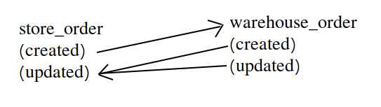

# Crestopher
## Two way sync between two apps

Backend rest api service that contains two applications: **store** & **warehouse**. Each of the app has its own database and **order** model/table. After store_order being created post_save signal is calling [Celery](http://docs.celeryproject.org/en/latest/) task, that make http request to get newly created order, updates its status and then creates warehouse_order. After warehouse_order updates its status store_order also would be updated.
In other words warehouse_order updates store_order on any update, when store_order updates/creates warehouse_order only it was just created.




## Problems of two way sync that have been resolved by this solution
#### When to update:
First issue to resolve is the moment of synchronization. For example it might be resolved by some schedular module that calls for update every N minutes. But that way there would be always risk of getting not updated data in requests

So right moment is right after create/update (current solution)

#### Techical problem of syncronist python (post_save signal freezes admin panel until all actions caused by post request done):
This project uses Celery that makes async calls

#### Circural updates (a updates b, b updates a, repeat):
There is clear division of update calling reasons for each model. store_order only creates warehouse_order but never updates it (there might be set of condition to break that rule, like if you create store_order, then delete it, then create store_order with same id). warehouse_order updates store_order only when it is updated (not exactly: warehouse_order updates store_order if warehouse_status was created or updated **and its status isnt default**).


#### Problems of broken YAGNI:
Every new meaningful feature could produce a problem, this project so far respects [YAGNI](https://en.wikipedia.org/wiki/You_aren%27t_gonna_need_it) principle, so its by default resolves all these problems you might have with overdone execution

## Routes to call
http://0.0.0.0:8000/store/orders   http://0.0.0.0:8000/warehouse/orders
```
urlpatterns = [
    path('orders/', OrderListView.as_view()),
    re_path(r'^orders/(?P<pk>[0-9a-f-]+)/$', OrderRetrieveView.as_view()),
    re_path(r'^orders/(?P<pk>[0-9a-f-]+)/update/$', OrderUpdateView.as_view()),
]
```

## How to run it
The best way is to use docker-compose because there is too many dependencies you need to get otherwise.

1. First of all get containers running
```
docker-compose up -d --build
```
2. Make it run migrations (order matters)
```
docker-compose run crestopher python manage.py makemigrations warehouse
docker-compose run crestopher python manage.py migrate --database=warehouse

docker-compose run crestopher python manage.py makemigrations store
docker-compose run crestopher python manage.py migrate --database=store
```
3. To have access to admin panel you need to create admin (here username would be admin and password: hard2crack)
```
docker-compose run crestopher python manage.py shell -c "from django.contrib.auth.models import User; User.objects.filter(email='admin@example.com').delete(); User.objects.create_superuser('admin', 'admin@example.com', 'hard2crack')"
```
4. Login at http://0.0.0.0:8000/admin/ and now to create store_order go to the http://0.0.0.0:8000/admin/store/order/add/  
**dont change default status though, theres check in code for "some status" that decides if update is needed for store_order**

5. Check logs or view db gui for newly created warehouse_orders
```
docker-compose logs crestopher
```
store_db
```
docker exec -ti store_db psql -U postgres -W
Password for user postgres: postgres
select * from store_order;
```
warehouse_db
```
docker exec -ti warehouse_db psql -U postgres -W
Password for user postgres: postgres
select * from warehouse_order;
```
